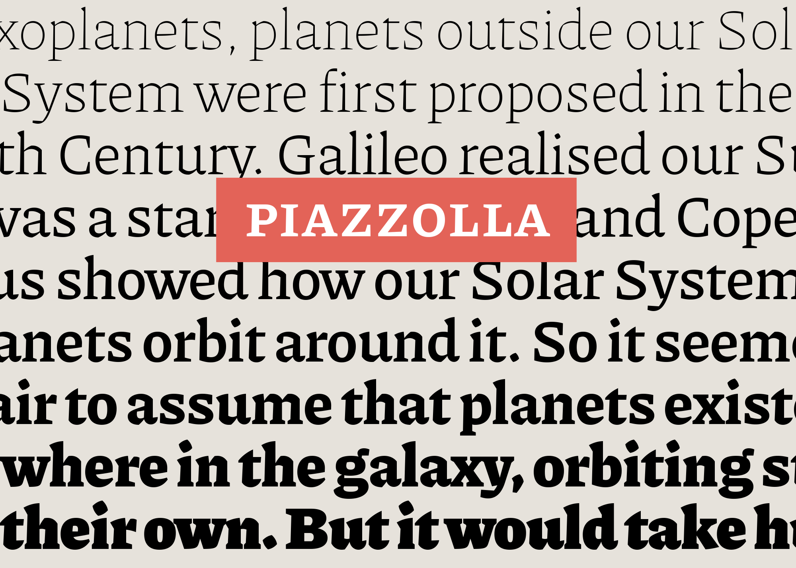

# Piazzolla font family

Type system intended for optimizing the available space in press media and other publications. It has a compact appearance which allows for small font sizes and tight leading while achieving solid lines and robust paragraphs.

Piazzolla has a distinctive voice that conveys a personal style, especially in display sizes. It has great performance and readability in small point sizes and long texts, both for screen and printing.

## Download

- Download the latest version of [Piazzolla](https://github.com/huertatipografica/piazzolla/releases/latest/download/Piazzolla.zip) and [Piazzolla SC](https://github.com/huertatipografica/piazzolla/releases/latest/download/PiazzollaSC.zip)
- For older versions and the changelog, you can refer to the [releases section](https://github.com/juandelperal/piazzolla/releases)

## Contributing

#### Requirements

- Glyphs (for editing sources)
- Python 3 (for building fonts)

#### Setup

To run any of the commands, you need to generate the virtual environment (venv) and install dependencies. It will generate a `venv` folder

    python3 -m venv venv
    . venv/bin/activate
    pip install --upgrade pip
    pip install -r requirements.txt

#### Build ufos and generate fonts

To build the fonts there are several steps and all the process is being handled by a custom script. All the magic happens by running in terminal:

    bash build.sh

#### Running tests

for Variable Fonts

    fontbakery check-universal fonts/Piazzolla/variable/ttf/*

for Static Fonts

    fontbakery check-universal fonts/Piazzolla/static/ttf/*

for UFO sources (replace `UFO_PATH` for the ufo you want to check)

    fontbakery check-ufo-sources UFO_PATH

